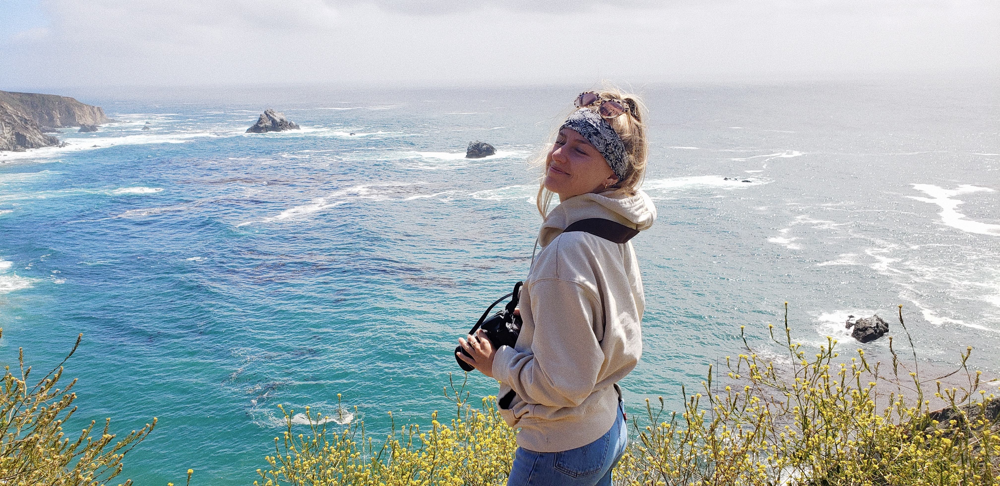

# Hi, I'm Oceane Roux.

-----
-----

I am a 4th year undergraduate student at the University of California, Santa Barbara, studying geography with an emphasis on Geographic Information Science. My love for traveling and the environment has lead me to pursue a career in Geography, specifically GIS. I am interested in applying by knowledge of spatial analysis to contribute in battling the effects of climate change by continuing to bring awareness to the public and working with researchers to find better solutions. 

Outside of school and work, I like to spend as much time as possible outdoors. In the winter months, you can find me snowboarding just about every weekend and surfing in the summer as soon as the ocean is warm enough. I also love to go on hikes, visit my favorite national parks, and go scuba diving.

-----
-----

`r icons::fontawesome$solid$globe` 
`r icons::fontawesome$solid$plus`
`r icons::fontawesome$brands$'r-project'`
`r icons::fontawesome$solid$equals`
`r icons::fontawesome$solid$heart`

